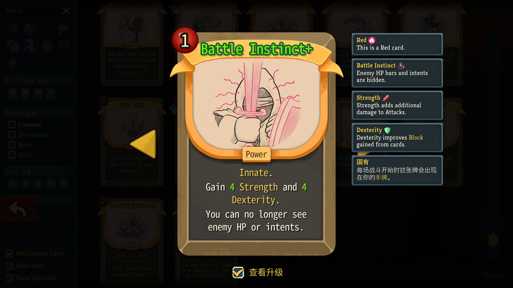

[中文](../README.md) | EN

# Gaoshou — A Slay the Spire 2 Character Mod

> **⚠️ Work in Progress**: Still in **active development** — expect bugs, and **balance is very much subject to change**. Feedback and ideas are more than welcome.

## What's This?

"Gaoshou" (a.k.a. "The Pro") is a character mod for **[Slay the Spire 2](https://store.steampowered.com/app/2868840/Slay_the_Spire_2/)**, built on the **RitsuLib 0.5.x** framework. It adds:

- A brand-new character with their own card pool, relics and buffs
- **91 cards** in total: 4 starters · 18 commons · 31 uncommons · 24 rares · 2 ancient-exclusives · 11 signature "Junk" tokens · 1 generated card
- A dual-resource economy + card-color **Flow** system
- Plenty of custom keywords and buffs
- A full set of stylized card art
- Crisp, readable descriptions with keyword tooltips

## How to Play (The Vibes)

Play as a day-one Slayer. Facing Antonio's relentless walls of bullshit and his *impeccable* number design, you whip out this thunder of a mod and yell: **"I'm done playing vanilla, Antonio!"**

- Your starter relic lets you convert **Energy ↔ Stars** mid-combat for nice profits.
- Draft carefully, pick your colors, and let cards **flow** through your hand — finish fights swift and stylish.
- Time your plays to trigger **Storm** and seize game-changing turns.
- Transform, generate, retain, draw — chain **Miracles** in a dazzling one-turn show.
- ~~Struggle in multiplayer.~~
- Learn misty Chinese characters(NOT, just kidding.)
- Savor the quirky design touches, then come file a *Future* — add your own, and let's ascend(?) together LOL
- And much more! ~~Get it on the Workshop right now!~~ Not yet — hold on, it's in uploading.



## Structure

```
GaoshouCode/   C# sources (cards / relics / powers / patches)
Gaoshou/       resource root (localization, images, scenes)
```

## Credits

- **Assets**: Card art & icons are extracted from **[Diceomancer](https://store.steampowered.com/app/2501600/_/)**. **All rights to the assets belong to their original creators**; this project is a fan rework for learning purposes only.
- **AssetRipper**: asset extraction — https://github.com/AssetRipper/AssetRipper
- **RitsuLib**: the mod framework — https://github.com/Ritsu-Ritsu/RitsuLib
- **LexNinja2**: framework & card-pool injection references — https://github.com/Flimsyyy/LexNinja2
- **Well Laid Plans Multiplayer**: multiplayer patch references — https://github.com/Redem714233/WellLaidPlansMultiplayer

## Feedback

- 🐛 Found a bug? File it via the [bug report template](.github/ISSUE_TEMPLATE/bug_report.md).
- 💡 Got an idea? Throw it in via the [feature request template](.github/ISSUE_TEMPLATE/feature_request.md).
- ⚖️ Balance opinions? They belong in feature requests too.