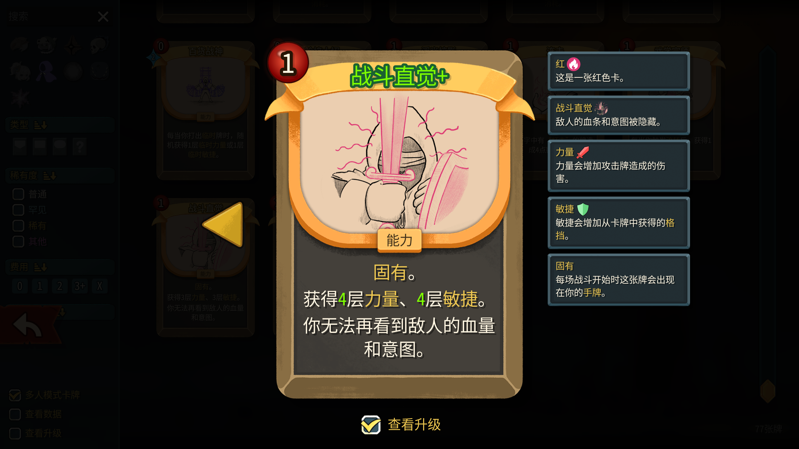

中文 | [EN](README-EN.md)

# 高手 — Slay the Spire 2 角色模组

> **开发中 Warning**：本模组仍处于**开发阶段**，很可能存在 BUG，且**卡牌平衡性有待调整**。欢迎反馈与建议。

## 项目简介

「高手」是一个为 **[Slay the Spire 2](https://store.steampowered.com/app/2868840/Slay_the_Spire_2/)** 制作的角色模组，基于 **RitsuLib 0.5.x** 框架开发。模组提供：

- 全新角色「高手」及其专属卡池、遗物、Buff
- 4初始、18普通、31罕见、24稀有、2先古、11张特色废品牌、1张衍生牌，共计**91**张卡牌
- 双资源与卡牌颜色流转体系
- 多种特色关键词与Buff
- 全套风格化卡图
- 清晰明了的描述、关键词注释

## 玩法速览

扮演一名首发购入的Slayer，在安东尼的层层堵截与精妙的数值设计前，掏出雷霆mod，大喊：“我不做原版玩家了，安八分钱！”

- 战斗中通过初始遗物，将能量与星辉互相转化，获得可观收益。
- 平衡卡组构筑，在颜色间取舍，让卡牌在手中**流转**，迅捷优雅地结束战斗。
- 在合适时机打出卡牌，触发**风暴**，以获得足以改变战局的力量。
- 回合内变化、生成、保留、抽牌，在战斗中上演令人眼花缭乱的**奇迹**。
- ~~在多人游戏里当区。~~
- 品鉴制作组的小巧思，然后回来提Future——加入你的小巧思，一起成为神人！
- 还有更多！ ~~即刻前往创意工坊下载！~~ 还没上传，别急。



## 目录结构

```
GaoshouCode/   C# 源码（卡牌/遗物/能力/补丁）
Gaoshou/       资源根（localization 多语言、images、scenes）
```

## 鸣谢

- **素材来源**：卡面/图标素材提取自游戏 **[骰子浪游者（Diceomancer）](https://store.steampowered.com/app/2501600/_/)**，**素材版权归原作者所有**；本项目仅作学习用途的角色化再创作。
- **AssetRipper**：用于提取素材资源 — https://github.com/AssetRipper/AssetRipper
- **RitsuLib**：模组框架 — https://github.com/Ritsu-Ritsu/RitsuLib
- **LexNinja2**：模组框架与牌池注入等实现参考 — https://github.com/Flimsyyy/LexNinja2
- **计划妥当多人联机修复（Well Laid Plans Multiplayer）**：多人补丁实现参考 — https://github.com/Redem714233/WellLaidPlansMultiplayer

## 反馈

- 🐛 遇到 BUG？请按 [BUG 报告模板](.github/ISSUE_TEMPLATE/bug_report.md) 提交
- 💡 有想法？请按 [功能建议模板](.github/ISSUE_TEMPLATE/feature_request.md) 提交
- ⚖️ 平衡性意见，欢迎一并附在建议中